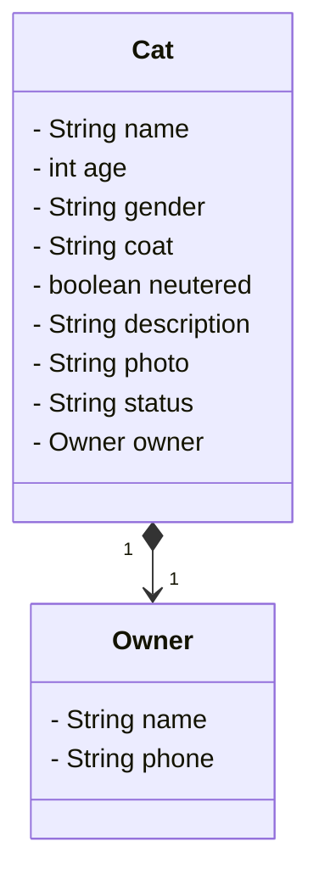

# dio-trilha-java-basico-final-3
Desafio final do Santander Bootcamp 2024 da DIO.

**Tema:** lista de adoção de gatos

###### Modelando o problema
**Requisitos:**
- CRUD de gatos para adoção 
- Serviços de busca por categorias (sexo, cor do pelo) e  adoção  

**Informações:**
```JSON
{
"name": "Tom",
"age": 4,
"gender": "male",
"coat": "black and white",
"neutered": true,
"description": "brief description of the cat's personality and special characteristics",
"photo": "URL",
"status": "adopted",
"owner": {
	"name": "Sophia",
	"phone": "phone number"
}
}
```



###### Configurando o projeto
- Criando o projeto via initializr
	- [Settings](https://start.spring.io/#!type=gradle-project&language=java&platformVersion=3.3.2&packaging=jar&jvmVersion=17&groupId=me.ow&artifactId=adoption-list&name=adoption-list&description=Final%20Challenge%20of%20DIO%20Santander%20Bootcamp%202023&packageName=me.ow.adoption-list&dependencies=web,data-jpa,h2,postgresql)
